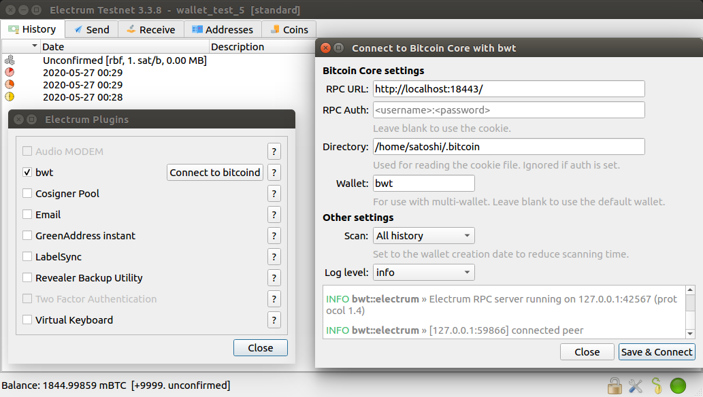

# Bitcoin Wallet Tracker - Electrum Plugin

[](https://travis-ci.org/bwt-dev/bwt-electrum-plugin)
[](https://github.com/bwt-dev/bwt-electrum-plugin/releases/tag/v0.2.1)
[](https://github.com/bwt-dev/bwt-electrum-plugin/releases)
[](https://github.com/bwt-dev/bwt-electrum-plugin/blob/master/LICENSE)
[](https://github.com/bwt-dev/bwt#developing)

Electrum plugin for [Bitcoin Wallet Tracker](https://github.com/bwt-dev/bwt), a lightweight personal indexer for bitcoin wallets.

The plugin allows connecting Electrum to a Bitcoin Core full node backend, by running
an embedded bwt Electrum server within the Electrum wallet itself.

Support development: [⛓️ on-chain or ⚡ lightning via BTCPay](https://btcpay.shesek.info/)



## Compatibility

The plugin supports Electrum v3 and v4. It is available for Linux, Mac, Windows and ARMv7/v8. It works with multi-signature wallets. It *does not* support Lightning.

Bitcoin Core v0.19+ is recommended, but it can work (not as well) with v0.17+. `txindex` is not required.
Pruning is supported, but you can only scan for transactions in the non-pruned history.

It is not possible to install external plugins with the Electrum AppImage or standalone Windows executable.
You will need to [run from tar.gz](https://github.com/spesmilo/electrum/#running-from-targz) on Linux,
use the Windows installer, install using a package manager,
or [run from source](https://github.com/spesmilo/electrum/#development-version-git-clone).

The plugin currently **supports watch-only wallets only** and [*cannot be used with hot wallets*](https://twitter.com/shesek/status/1275057901149667329). This is expected to eventually change.
For now, you can use the plugin with hardware wallets or with an offline Electrum setup.
For hot wallets, you will need to [setup a standalone server](https://github.com/bwt-dev/bwt#setting-up-bwt)
instead of using the plugin.

## Installation

1. Install and sync Bitcoin Core. If you're using QT, make sure to set `server=1` in your config file.

   > It is recommended, but not required, to create a separate bitcoind wallet with `createwallet <name> true`.
2. Download the bwt plugin from the [releases page](https://github.com/bwt-dev/bwt-electrum-plugin/releases) and verify the signature (see below).

3. Unpack the `bwt` directory into your `electrum/plugins` directory.

   > You can find the location if your plugins directory by running `electrum.plugins.__path__` in the Electrum console tab.

4. Restart Electrum, open `Tools -> Plugins`, enable `bwt`, click `Connect to bitcoind`, configure your Bitcoin Core RPC details, and click `Save & Connect`. That's it!

On the first run, rescanning for historical transactions from genesis may take up to 2-3 hours. To speed this up, set the rescan date to when
the wallet was created (or disable rescanning entirely for new wallets). If your node is pruned, the rescan date has to be within
the range of non-pruned blocks.

The plugin automatically configures Electrum with `oneserver` (to avoid connecting to public servers) and `skipmerklecheck` (necessary for [pruning](https://github.com/bwt-dev/bwt#pruning)).
To avoid connecting to public servers while setting up the plugin, make sure the "auto connect" feature is disabled or run Electrum with `--offline` until everything is ready.

#### Verifying the signature

The releases are signed by Nadav Ivgi (@shesek).
The public key can be verified on
the [PGP WoT](http://keys.gnupg.net/pks/lookup?op=vindex&fingerprint=on&search=0x81F6104CD0F150FC),
[github](https://api.github.com/users/shesek/gpg_keys),
[twitter](https://twitter.com/shesek),
[keybase](https://keybase.io/nadav),
[hacker news](https://news.ycombinator.com/user?id=nadaviv)
and [this video presentation](https://youtu.be/SXJaN2T3M10?t=4) (bottom of slide).


```bash
# Download plugin (change x86_64-linux to your platform)
$ wget https://github.com/bwt-dev/bwt-electrum-plugin/releases/download/v0.2.1/bwt-electrum-plugin-0.2.1-x86_64-linux.tar.gz

# Fetch public key
$ gpg --keyserver keyserver.ubuntu.com --recv-keys FCF19B67866562F08A43AAD681F6104CD0F150FC

# Verify signature
$ wget -qO - https://github.com/bwt-dev/bwt-electrum-plugin/releases/download/v0.2.1/SHA256SUMS.asc \
  | gpg --decrypt - | grep x86_64-linux | sha256sum -c -
```

The signature verification should show `Good signature from "Nadav Ivgi <nadav@shesek.info>" ... Primary key fingerprint: FCF1 9B67 ...` and `bwt-electrum-plugin-0.2.1-x86_64-linux.tar.gz: OK`.

## Building from source

To build the plugin from source, first build the `bwt` binary (as also [described here](https://github.com/bwt-dev/bwt#from-source)),
copy it into the `src` directory in this repo, then copy that directory into `electrum/plugins`, *but renamed to `bwt`* (Electrum won't recognize it otherwise).

```bash
$ git clone https://github.com/bwt-dev/bwt-electrum-plugin && cd bwt-electrum-plugin
$ git checkout <tag>
$ git verify-commit HEAD
$ git submodule update --init

$ cd bwt
$ cargo build --release --no-default-features --features cli,electrum
$ cd ..
$ cp bwt/target/release/bwt src/
$ cp -r src /usr/local/lib/python3.8/site-packages/electrum/plugins/bwt
```

## Reproducible builds

The builds for all supported platforms can be reproduced in a Docker container environment as follows:

```bash
$ git clone https://github.com/bwt-dev/bwt-electrum-plugin && cd bwt-electrum-plugin
$ git checkout <tag>
$ git verify-commit HEAD
$ git submodule update --init

# Linux, Windows, ARMv7 and ARMv8
$ docker build -t bwt-builder - < bwt/scripts/builder.Dockerfile
$ docker run -it --rm -u `id -u` -v `pwd`:/usr/src/bwt-electrum-plugin -w /usr/src/bwt-electrum-plugin \
  --entrypoint scripts/build.sh bwt-builder

# Mac OSX (cross-compiled via osxcross)
$ docker build -t bwt-builder-osx - < bwt/scripts/builder-osx.Dockerfile
$ docker run -it --rm -u `id -u` -v `pwd`:/usr/src/bwt-electrum-plugin -w /usr/src/bwt-electrum-plugin \
  --entrypoint scripts/build.sh bwt-builder-osx

$ sha256sum dist/*
```

The builds are [reproduced on Travis CI](https://travis-ci.org/github/bwt-dev/bwt-electrum-plugin/branches) using the code from GitHub.
The SHA256 checksums are available under the "Reproducible builds" stage.

## License

MIT
